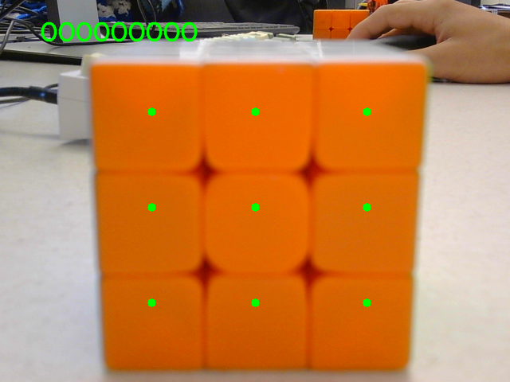

# Rubiks Cubot

A Rubik's Cube Solving Robot.

**Contributors**
- Andrew Holmes
- Dylan Scott Carroll
- Tarnivir Virk
- Jonathon Ly

## Environment Set Up

**Set up with UV**

- Install `uv`:
   ```bash
   curl -LsSf https://astral.sh/uv/install.sh | sh
   ```

- Create your environment by syncing with the provided files
   ```bash
    uv sync
    ```
- Running a script with `uv`:
    ```bash
    uv run script.py
    ```

## Problem Set Up

- This repo uses the [kociemba algorithm](https://kociemba.org/) from the [kociemba package](https://github.com/muodov/kociemba) to solve the cube
- The kociemba algorithm is designed to solve the cube usng moves in the set {U, R, D, F, B, L} and ther inverses
- See example below for what that looks like

**Solving a Rubik's Cube with Regular Moves**


- Our robot is designed with three main components (tray, fork, hand)
    1. Tray: holds the cube and can rotate cw and ccw
    2. Fork: 3D-printed fork that can extend/retract and rotate cw and ccw
    3. Hand: Can swivel down and raise back up

- The tray allows the cube to move in the move set {Y, Yi}
- The fork allows the cube to move in the move set {X, Xi
- The hand + tray combo allows the cube to move in the move set {D, Di}}

- Thus our new move set is {Y, X, D} and their inverses
- See example below for what that looks like

**Solving a Rubik's Cube with the Constrained Moves of our Robot**


## Color Scanner
- The color scanner utilizes a webcam that when toggled with specific robot command will scan a single face of the cube and map the pixel's hue, saturation, and value to one of the six colors
- We can construct a cube string by manipulating the cube so that every face is seen once by the webcam

